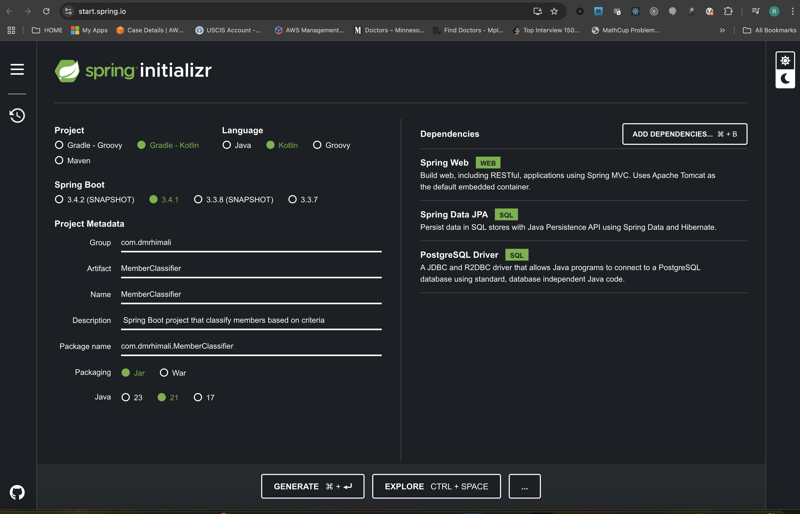
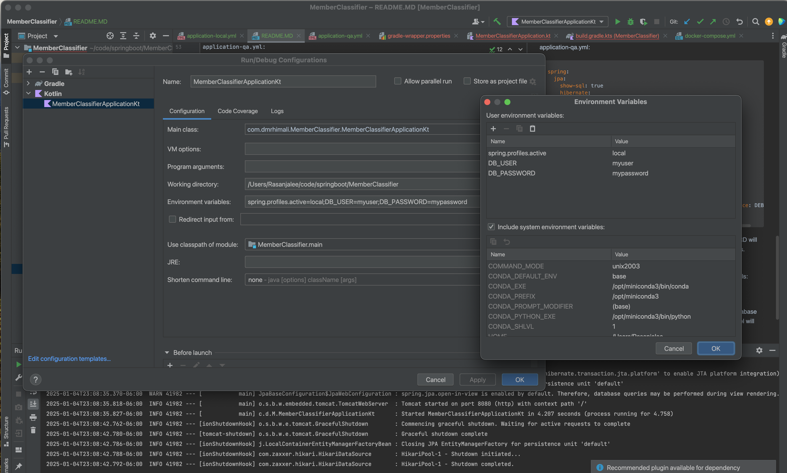

## REst API for Member Classification


This project will store member health related details and member classification definitions(segmentation rules) in a postgresql database. 
For  example, a sample segmentation rule is men and women who have bmi > 25 and age between 30 and 45.
The queries cannot be predefined in the repository as the segmentation rules are dynamic and subjected to change.

this project develop REST api endpoints that allow creating members, classification definitions as well as evaluating members against these classification definitions.

I have come up wth a generic json structure that allows users to specify queries and backend services will convert them to SQL queries dynamically.

For example if we save a json query in database (`/classification_rules/save`) , upon executing `/classification_rules/{rule_id}/members` the query will be dynamically converted to SQL query and executed agains database and results will be returned :

save a json query `POST http://localhost:8081/classification_rules/save`:

```json
{
  "name": "Rule for Female or Male Members in California with Age Between 18 and 30",
  "rule": {
		"or": [
			{
				"member": {
					"gender": {"equals": "FEMALE"},
					"state": {"equals": "CA"},
					"age": {"between": {"start": 18, "end": 30}}
    		}
			},
			{
				"member": {
					"gender": {"equals": "MALE"},
					"state": {"equals": "CA"},
					"age": {"between": {"start": 18, "end": 30}}
    		}
			}
		]	
	}
}
```

execute a query and get matching members `GET http://localhost:8081/classification_rules/13/members`:

response:
```json
{
	"success": true,
	"data": [
		{
			"memberId": 1,
			"name": "Tina Doe",
			"gender": {
				"id": 2,
				"type": "FEMALE",
				"description": "Female Gender"
			},
			"age": 44,
			"dateOfBirth": "1981-01-01",
			"healthStatus": {
				"generalHealthRating": {
					"id": 3,
					"type": "FAIR",
					"description": "Some health problems affecting quality of life"
				},
				"mentalHealthStatus": {
					"id": 1,
					"type": "COPING_WELL",
					"description": "Currently coping well with mental health"
				},
				"height": 156.0,
				"weight": 91.0,
				"bmi": 37.4,
				"bloodPressure": "120/80",
				"cholesterolLevel": "BORDERLINE",
				"stressLevels": "LOW",
				"chronicConditions": [
					"DIABETES",
					"ASTHMA"
				],
				"mentalHealthHistory": []
			}
		}
	],
	"error": null
}
```


See [insomnia endpoint list](Insomnia_member_classifier_endpoints.yaml) for trying out the full list of endpoints.

## Quick guide

### 1. run database:
`$ docker-compose up -d`

### 2. run this project in Intellij idea with following environmental variables set:
`spring.profiles.active=local;DB_USER=myuser;DB_PASSWORD=mypassword`

### 3. try some endpoints:
import [insomnia endpoint list](Insomnia_member_classifier_endpoints.yaml) to insomnia and:
- create a member: `POST http://localhost:8081/members/save`
- create a classifier: `POST http://localhost:8081/classification_rules/save`
- get members for  a classifier `GET http://localhost:8081/classification_rules/{ruleId}/members`


## Setup project
Here is a detailed guide on how to set up project. 
set up spring boot project using https://start.spring.io/ with:
- kotlin
- springboot starter web
- springboot starter jpa
- springboot starter validation (for jpa entity validation)
- springboot starter json
- postgresql
- flyway core
- flyway postgresql

Download and build project (You might need to fix following before running):

- Intellij IDEA > Setting > Build,Execution, Deployment > Build Tools> Gradle> Gradle JVM=Project SDK(Coretta 21)
- Intellij IDEA > File> Project Structure> Project> SDK=Coretto21
- MemberClassifier> gradle> wrapper> gradle-wrapper.properties (distributionUrl=https\://services.gradle.org/distributions/gradle-8.5-bin.zip)




## Setup database

docker-compose.yml:
```yaml
version: "3.8"

services:
  postgres:
    image: postgres:14
    container_name: postgresdb
    environment:
      - POSTGRES_DB=memberDb
      - POSTGRES_USER=myuser
      - POSTGRES_PASSWORD=mypassword
    ports:
      - "5432:5432"
    volumes:
      - postgres-data:/var/lib/postgresql/data  # Persist database data
    networks:
      - myNetwork

volumes:
  postgres-data:
    driver: local

networks:
  myNetwork:
    driver: bridge
```

Run `docker-compose up -d` to bring up postgres container with given database created.

You can connect to container and query db:
```shell
$ docker exec -it  postgresdb psql -U myuser -d memberDbmemberDb=# \dt

memberDb=# \dt
Did not find any relations.


```

## Setup application environments
Now we will setup local and qa environments

application-local.yml:
```yaml

spring:
  jpa:
    show-sql: true
    hibernate:
      ddl-auto: validate
    properties:
      hibernate.jdbc.batch_size: 20
      hibernate.cache.use_query_cache: false
      hibernate.cache.use_second_level_cache: false
      hibernate.cache.use_structured_entries: false
      hibernate.cache.use_minimal_puts: false
  datasource:
    url: jdbc:postgresql://localhost:5432/memberDb
    username: ${DB_USER}
    password: ${DB_PASSWORD}
    driverClassName: org.postgresql.Driver
  logging:
    level:
      org.springframework: INFO
      org.springframework.jdbc.datasource.DriverManagerDataSource: DEBUG
      org.springframework.boot.autoconfigure.jdbc: DEBUG
```

application-qa.yml:
```yaml
spring:
  jpa:
    show-sql: true
    hibernate:
      ddl-auto: validate
    properties:
      hibernate.jdbc.batch_size: 20
      hibernate.cache.use_query_cache: false
      hibernate.cache.use_second_level_cache: false
      hibernate.cache.use_structured_entries: false
      hibernate.cache.use_minimal_puts: false
  datasource:
    url: jdbc:postgresql://qaHost:5432/memberDb
    username: ${DB_USER}
    password: ${DB_PASSWORD}
    driverClassName: org.postgresql.Driver
  logging:
    level:
      org.springframework: INFO
      org.springframework.jdbc.datasource.DriverManagerDataSource: DEBUG
      org.springframework.boot.autoconfigure.jdbc: DEBUG
```

`spring.jpa.hibernate.ddl-auto` is used for database initialization.
If we set the value to `update` value, then a table will be created in the database automatically corresponding to defined data model.
Any change to the model will also trigger an update to the table. For production, this property should be `validate`.

in application-qa.yml only db url is different. DB_USER, and DB_PASSWORD will also be different for each envorment and will be exported before running this.

In Intellij, the run config (and build config if you build seperately) for MemberClssifierApplication.kt should contain active profile and db credentials:




## Migrate data to database
Now let's setup tables and add some initial data. We will use Flyway.

See [tutorial](https://blog.jetbrains.com/idea/2024/11/how-to-use-flyway-for-database-migrations-in-spring-boot-applications/)

#### 1. Add Flyway to `build.gradle.kts`:

Create a `.env` file(also add it to .gitignore) in repository root with usernme pass for db:
```shell
DB_USER=myuser
DB_PASSWORD=mypassword
```

add `flyway` and `dotenv` plufgins , add flyway configuration and read password from .env file .
```shell
plugins {
    # ...
    id("org.flywaydb.flyway") version "9.5.1"  // Flyway plugin
    id("co.uzzu.dotenv.gradle") version "4.0.0" //dotenv plugin
}

dependencies {
    ..
    implementation("org.flywaydb:flyway-core")
	implementation ("org.flywaydb:flyway-database-postgresql")
    ..
}

// Flyway configuration
flyway {
	url = "jdbc:postgresql://localhost:5432/memberDb"
	user = env.DB_USER.orElse("myuser")
	password = env.DB_PASSWORD.orElse("mypassword")
	locations = arrayOf("classpath:db/migration")
}
```

**Refresh gradle or reload build.gradle.kts file**

Now you have new set of tasks avaiable in gradle related to flyway: (see gradle window)
- `flywayMigrate` : (run as `./gradlew flywayMigrate`)
- `flywayClean`: 
- `flywayInfo`: (check the status of the migrations: `./gradlew flywayInfo`)


Now reload gradle file to take effect.


#### 2. Configure flyway

`application-local.yaml`:
Note that we specify additional location in local (classpath:db/migration/local) as we will load some initial data to tables
```yaml
spring:
    ...
  
    flyway:
      enabled: true  # Enable Flyway migrations
      locations: classpath:db/migration,classpath:db/migration/local  # Location of migration scripts. default: src/main/resources/db/migration, additonal: src/main/resources/db/migration/local
```

`application-qa.yml`:
```yaml
```yaml
spring:
    ...
  
    flyway:
      enabled: true  # Enable Flyway migrations
      locations: classpath:db/migration # Location of migration scripts. default: src/main/resources/db/migration
```

Configure Gradle to Run Flyway Migrations During Build:

`build.gradle.kts`:
```shell
plugins {
    id("org.flywaydb.flyway") version "9.7.0" // Add Flyway plugin
}

# run flyway migrations during build
flyway {
    url = "jdbc:postgresql://localhost:5432/your_database"
    user = "your_username"
    password = "your_password"
    locations = arrayOf("classpath:db/migration")
}

```

#### 3. Create migration scripts

Spring Boot provides out-of-the-box support for Flyway database migrations. 
Once the Flyway Migrations dependency is added, you can add your Flyway migration scripts 
in the `src/main/resources/db/migration` directory. 
When you start the application, Spring Boot will apply the pending Flyway migrations automatically.

We will add more scripts for local with additional insert statements to populate tables with some initial data.

We will use `JPA first approach`: we will create our JPA entities representing relations and auto generate the flyway migrations based on them.

**We will first create the JPA Entities**:  [JPA Entities](src/main/kotlin/com/dmrhimali/memberClassifier/model)

**Next we will create migration scripts**: [migration scripts](src/main/resources/db/migration)

You cn use DB tool in intellij ultimate to create your scripts automatically or write them manually.

#### 4. run migrations

Run Migrations with Spring Boot run: 

`./gradlew bootRun`

Run Flyway migrations separately from the Spring Boot application startup:

`./gradlew flywayMigrate`

I ran migrations separately and here are tables created:
```shell
$ docker exec -it  postgresdb psql -U myuser -d memberDb
psql (14.15 (Debian 14.15-1.pgdg120+1))
Type "help" for help.

memberDb=# \dt
                        List of relations
 Schema |                 Name                  | Type  | Owner  
--------+---------------------------------------+-------+--------
 public | address                               | table | myuser
 public | cholesterol_level                     | table | myuser
 public | chronic_condition                     | table | myuser
 public | classification_rules                  | table | myuser
 public | contact                               | table | myuser
 public | flyway_schema_history                 | table | myuser
 public | gender                                | table | myuser
 public | general_health_rating                 | table | myuser
 public | health_status                         | table | myuser
 public | health_status_chronic_condition       | table | myuser
 public | health_status_mental_health_condition | table | myuser
 public | member                                | table | myuser
 public | mental_health_condition               | table | myuser
 public | mental_health_status                  | table | myuser
 public | stress_level                          | table | myuser
(15 rows)

memberDb=# \ds
                       List of relations
 Schema |               Name               |   Type   | Owner  
--------+----------------------------------+----------+--------
 public | address_id_seq                   | sequence | myuser
 public | cholesterol_level_id_seq         | sequence | myuser
 public | chronic_condition_id_seq         | sequence | myuser
 public | classification_rules_rule_id_seq | sequence | myuser
 public | contact_id_seq                   | sequence | myuser
 public | gender_id_seq                    | sequence | myuser
 public | general_health_rating_id_seq     | sequence | myuser
 public | health_status_id_seq             | sequence | myuser
 public | member_id_seq                    | sequence | myuser
 public | mental_health_condition_id_seq   | sequence | myuser
 public | mental_health_status_id_seq      | sequence | myuser
 public | stress_level_id_seq              | sequence | myuser


memberDb=# select * from cholesterol_level;
 id |   level    |          description          
----+------------+-------------------------------
  1 | NORMAL     | Normal cholesterol levels
  2 | BORDERLINE | Borderline cholesterol levels
  3 | HIGH       | High cholesterol levels
  4 | VERY_HIGH  | Very high cholesterol levels
(4 rows)

memberDb=# select * from chronic_condition;
 id |  condition   |                   description                   
----+--------------+-------------------------------------------------
  1 | HYPERTENSION | High blood pressure
  2 | DIABETES     | Chronic condition that affects sugar metabolism
  3 | ASTHMA       | A condition that affects breathing
  4 | ARTHRITIS    | Joint pain and inflammation
  5 | CANCER       | Disease in which cells divide without control
  6 | OTHER        | Any other chronic condition
(6 rows)

memberDb=# select * from gender;
 id |  type  |    description    
----+--------+-------------------
  1 | MALE   | Male Gender
  2 | FEMALE | Female Gender
  3 | OTHER  | Non-binary Gender
(3 rows)

memberDb=# select * from general_health_rating;
 id |  rating   |                    description                     
----+-----------+----------------------------------------------------
  1 | EXCELLENT | No major health problems
  2 | GOOD      | Occasional minor health issues
  3 | FAIR      | Some health problems affecting quality of life
  4 | POOR      | Multiple chronic conditions or major health issues
(4 rows)

memberDb=# select * from mental_health_status;
 id |        status         |                   description                   
----+-----------------------+-------------------------------------------------
  1 | COPING_WELL           | Currently coping well with mental health
  2 | UNDER_TREATMENT       | Receiving treatment for mental health condition
  3 | EXPERIENCING_SYMPTOMS | Experiencing symptoms of mental health issues
(3 rows)

memberDb=# select * from stress_level;
 id |  level   |       description        
----+----------+--------------------------
  1 | LOW      | Low level of stress
  2 | MODERATE | Moderate level of stress
  3 | HIGH     | High level of stress
(3 rows)

memberDb=# select * from mental_health_condition;
 id |    condition     |                                                                  description                                                                   
----+------------------+------------------------------------------------------------------------------------------------------------------------------------------------
  1 | DEPRESSION       | A mental state characterized by persistent feelings of sadness, hopelessness, and a lack of interest in daily activities.
  2 | ANXIETY          | A mental health disorder characterized by feelings of worry, anxiety, or fear that are strong enough to interfere with one''s daily activities.
  3 | BIPOLAR_DISORDER | A mental health disorder characterized by extreme mood swings that include emotional highs (mania or hypomania) and lows (depression).
  4 | SCHIZOPHRENIA    | A serious mental illness characterized by distorted thinking, perception, emotions, language, sense of self, and behavior.
  5 | OTHER            | Other mental health conditions not specifically categorized.
(5 rows)

memberDb=# select * from flyway_schema_history;
 installed_rank | version |   description   | type |         script          |  checksum  | installed_by |        installed_on        | execution_time | success 
----------------+---------+-----------------+------+-------------------------+------------+--------------+----------------------------+----------------+---------
              1 | 1       | create enums    | SQL  | V1__create_enums.sql    | 1904425583 | myuser       | 2025-01-07 21:36:22.692738 |             23 | t
              2 | 2       | create tables   | SQL  | V2__create_tables.sql   | 1811795034 | myuser       | 2025-01-07 21:36:22.763132 |            125 | t
              3 | 3       | insert metadata | SQL  | V3__insert_metadata.sql | 1722650503 | myuser       | 2025-01-07 21:36:22.925247 |             18 | t
(3 rows)

```

The flyway migration config in build.gradle.kts will refer to scripts in `build/resources/main/db/migration` so it is necessary to do `gradle>build` > `gradle>flyway>flywayMigrate` to migrate.
In case you have errors to fix in your local environment, do: `gradle>flyway>flywayClean` to clean everything setup by your sql scripts > fix your sql scripts in src/main/resources/db/migration >  `gradle>build>clean` > `gradle>build>build`(so updated sql resources land in build/resources/main/db/migration) > `gradle>flyway>flywayMigrate`

## Implement Services and Repositories

dto package is used for controller requests and responses. Here is the file organization in src root:

```shell
src
├── main
│   ├── kotlin
│   │   └── com
│   │       └── dmrhimali
│   │           └── memberClassifier
│   │               ├── MemberClassifierApplication.kt
│   │               ├── controller  ## <-- Controllers
│   │               │   └── MemberController.kt
│   │               ├── converter ## <-- Custom converters
│   │               ├── dto     ## Data Transfer objects to and from controllers
│   │               │   ├── request
│   │               │   │   ├── AddressRequest.kt
│   │               │   │   ├── ContactRequest.kt
│   │               │   │   ├── HealthStatusRequest.kt
│   │               │   │   └── MemberRequest.kt
│   │               │   └── response
│   │               │       ├── ApiResponse.kt
│   │               │       ├── ErrorResponse.kt
│   │               │       ├── HealthStatusInfoResponse.kt
│   │               │       └── MemberInfoResponse.kt
│   │               ├── exceptions  ## <-- Exceptions
│   │               │   ├── CholesterolLevelNotFoundException.kt
│   │               │   ├── ChronicConditionNotFoundException.kt
│   │               │   ├── GenderNotFoundException.kt
│   │               │   ├── GeneralHealthRatingNotFoundException.kt
│   │               │   ├── MemberNotFoundException.kt
│   │               │   ├── MentalHealthHistoryNotFoundException.kt
│   │               │   ├── MentalHealthStatusNotFoundException.kt
│   │               │   └── StressLevelNotFoundException.kt
│   │               ├── model   ## <-- JPA Entities
│   │               │   ├── Address.kt
│   │               │   ├── Contact.kt
│   │               │   ├── HealthStatus.kt
│   │               │   ├── Member.kt
│   │               │   ├── enums
│   │               │   │   ├── CholesterolLevelType.kt
│   │               │   │   ├── ChronicConditionType.kt
│   │               │   │   ├── ContactType.kt
│   │               │   │   ├── GenderType.kt
│   │               │   │   ├── GeneralHealthRatingType.kt
│   │               │   │   ├── MentalHealthHistoryType.kt
│   │               │   │   ├── MentalHealthStatusType.kt
│   │               │   │   └── StressLevelType.kt
│   │               │   └── metadata
│   │               │       ├── CholesterolLevel.kt
│   │               │       ├── ChronicCondition.kt
│   │               │       ├── Gender.kt
│   │               │       ├── GeneralHealthRating.kt
│   │               │       ├── MentalHealthHistory.kt
│   │               │       ├── MentalHealthStatus.kt
│   │               │       └── StressLevel.kt
│   │               ├── repository  ## <-- Repositories
│   │               │   ├── AddressRepository.kt
│   │               │   ├── CholesterolLevelRepository.kt
│   │               │   ├── ChronicConditionRepository.kt
│   │               │   ├── ContactRepository.kt
│   │               │   ├── GenderRepository.kt
│   │               │   ├── GeneralHealthRatingRepository.kt
│   │               │   ├── HealthStatusRepository.kt
│   │               │   ├── MemberRepository.kt
│   │               │   ├── MentalHealthHistoryRepository.kt
│   │               │   ├── MentalHealthStatusRepository.kt
│   │               │   └── StressLevelRepository.kt
│   │               └── service   ## <-- Services
│   │                   └── MemberService.kt
│   └── resources
│       ├── application-local.yml
│       ├── application-qa.yml
│       ├── db          ## <-- Migration scripts
│       │   └── migration
│       │       ├── V1__create_tables.sql
│       │       └── V2__insert_metadata.sql
│       ├── static
│       └── templates

```

### API calls

Endpoints are localted in 3 [Rest controllers](src/main/kotlin/com/dmrhimali/memberClassifier/controller):

1. [**HealthController**](src/main/kotlin/com/dmrhimali/memberClassifier/controller/HealthController.kt): Has endpoints for health related metadata
2. [**MemberClassificationController**](src/main/kotlin/com/dmrhimali/memberClassifier/controller/MemberClassificationController.kt): Has endpoints for classifier creation, evaluating members against them etc.
2. [**MemberController**](src/main/kotlin/com/dmrhimali/memberClassifier/controller/MemberController.kt): Has endpoints for member creation

#### MemberController endpoints
`GET http://localhost:8081/actuator`:

response:
```json
{
	"_links": {
		"self": {
			"href": "http://localhost:8081/actuator",
			"templated": false
		},
		"health": {
			"href": "http://localhost:8081/actuator/health",
			"templated": false
		},
		"health-path": {
			"href": "http://localhost:8081/actuator/health/{*path}",
			"templated": true
		}
	}
}
```

`GET http://localhost:8081/actuator/health`:

```json
{
	"status": "UP",
	"components": {
		"db": {
			"status": "UP",
			"details": {
				"database": "PostgreSQL",
				"validationQuery": "isValid()"
			}
		},
		"diskSpace": {
			"status": "UP",
			"details": {
				"total": 499963174912,
				"free": 49965326336,
				"threshold": 10485760,
				"path": "/Users/Rasanjalee/code/springboot/MemberClassifier/.",
				"exists": true
			}
		},
		"ping": {
			"status": "UP"
		},
		"ssl": {
			"status": "UP",
			"details": {
				"validChains": [],
				"invalidChains": []
			}
		}
	}
}
```

`GET http://localhost:8081/members/1/info`:

response:
```json
{
	"success": false,
	"data": null,
	"error": {
		"errorCode": "MEMBER_NOT_FOUND",
		"message": "Member with ID 1 not found.",
		"timestamp": "2025-01-09T10:24:38.744009",
		"details": null
	}
}
```

`POST http://localhost:8081/members/save`:
with json body:
```json
{
	"name" : "Tina Doe",
	"gender": "FEMALE",
	"address": {
		"street" : "123",
		"city" : "TypoCity",
		"state": "GA",
		"zipCode": "12345"
	},
	"dateOfBirth": "1981-01-01",
	"contacts": [
		{
			"type": "PHONE",
			"value": "123-456-7890"
		}
	],
	"healthStatus": {
		"generalHealthRating": "FAIR",
		"mentalHealthStatus": "COPING_WELL",
		"height": 156,
		"weight": 91,
		"bloodPressure": "120/80",
		"heartRate": "72",
		"cholesterolLevel": "BORDERLINE",
		"stressLevel": "LOW",
		"chronicConditions": [
			"DIABETES",
			"ASTHMA"
		],
		"mentalHealthHistory": []
	}
}
```


response:
```json
{
	"success": true,
	"data": {
		"memberId": 1,
		"name": "Tina Doe",
		"gender": {
			"id": 2,
			"type": "FEMALE",
			"description": "Female Gender"
		},
		"age": 44,
		"dateOfBirth": "1981-01-01",
		"healthStatus": {
			"generalHealthRating": {
				"id": 3,
				"type": "FAIR",
				"description": "Some health problems affecting quality of life"
			},
			"mentalHealthStatus": {
				"id": 1,
				"type": "COPING_WELL",
				"description": "Currently coping well with mental health"
			},
			"height": 156.0,
			"weight": 91.0,
			"bmi": 37.4,
			"bloodPressure": "120/80",
			"cholesterolLevel": "BORDERLINE",
			"stressLevels": "LOW",
			"chronicConditions": [
				"DIABETES",
				"ASTHMA"
			],
			"mentalHealthHistory": []
		}
	},
	"error": null
}
```

Now Get member endpoint returns member 1:
`GET http://localhost:8081/members/1/info`:

response:
```json
{
	"success": true,
	"data": {
		"memberId": 1,
		"name": "Tina Doe",
		"gender": {
			"id": 2,
			"type": "FEMALE",
			"description": "Female Gender"
		},
		"age": 44,
		"dateOfBirth": "1981-01-01",
		"healthStatus": {
			"generalHealthRating": {
				"id": 3,
				"type": "FAIR",
				"description": "Some health problems affecting quality of life"
			},
			"mentalHealthStatus": {
				"id": 1,
				"type": "COPING_WELL",
				"description": "Currently coping well with mental health"
			},
			"height": 156.0,
			"weight": 91.0,
			"bmi": 37.4,
			"bloodPressure": "120/80",
			"cholesterolLevel": "BORDERLINE",
			"stressLevels": "LOW",
			"chronicConditions": [
				"DIABETES",
				"ASTHMA"
			],
			"mentalHealthHistory": []
		}
	},
	"error": null
}
```

if you add a wrong value for an enum in your endpoint json body (e.x.: see `"mentalHealthStatus": "DEPRESSION",` which is not a valid value), you get a useful message:

`POST http://localhost:8081/members/save`

with json body:
```json
{
	"name" : "John Doe",
	"gender": "MALE",
	"address": {
		"street" : "456",
		"city" : "HelloCity",
		"state": "CA",
		"zipCode": "54345"
	},
	"dateOfBirth": "1982-10-31",
	"contacts": [
		{
			"type": "EMAIL",
			"value": "john.doe@gmail.com"
		}
	],
	"healthStatus": {
		"generalHealthRating": "POOR",
		"mentalHealthStatus": "DEPRESSION",
		"height": 156,
		"weight": 91,
		"bloodPressure": "150/90",
		"heartRate": "72",
		"cholesterolLevel": "NORMAL",
		"stressLevel": "HIGH",
		"chronicConditions": ["ARTHRITIS", "HYPERTENSION"],
		"mentalHealthHistory": [ "ANXIETY"]
	}
}
```

response:
```json
{
	"errorCode": "INTERNAL_SERVER_ERROR",
	"message": "JSON parse error: Cannot deserialize value of type `com.dmrhimali.memberClassifier.model.enums.MentalHealthStatusType` from String \"DEPRESSION\": not one of the values accepted for Enum class: [UNDER_TREATMENT, EXPERIENCING_SYMPTOMS, COPING_WELL]",
	"timestamp": "2025-01-09T11:03:21.199023",
	"details": null
}
```

Correct and post:

`GET http://localhost:8081/members/save`:
```json
{
	"name" : "John Doe",
	"gender": "MALE",
	"address": {
		"street" : "456",
		"city" : "HelloCity",
		"state": "CA",
		"zipCode": "54345"
	},
	"dateOfBirth": "1982-10-31",
	"contacts": [
		{
			"type": "EMAIL",
			"value": "john.doe@gmail.com"
		}
	],
	"healthStatus": {
		"generalHealthRating": "POOR",
		"mentalHealthStatus": "UNDER_TREATMENT",
		"height": 156,
		"weight": 91,
		"bloodPressure": "150/90",
		"heartRate": "72",
		"cholesterolLevel": "NORMAL",
		"stressLevel": "HIGH",
		"chronicConditions": ["ARTHRITIS", "HYPERTENSION"],
		"mentalHealthHistory": [ "DEPRESSION"]
	}
}
```

response:
```json
{
	"success": true,
	"data": {
		"memberId": 2,
		"name": "John Doe",
		"gender": {
			"id": 4,
			"type": "MALE",
			"description": "Male Gender"
		},
		"age": 42,
		"dateOfBirth": "1982-10-31",
		"healthStatus": {
			"generalHealthRating": {
				"id": 8,
				"type": "POOR",
				"description": "Multiple chronic conditions or major health issues"
			},
			"mentalHealthStatus": {
				"id": 5,
				"type": "UNDER_TREATMENT",
				"description": "Receiving treatment for mental health condition"
			},
			"height": 156.0,
			"weight": 91.0,
			"bmi": 37.4,
			"bloodPressure": "150/90",
			"cholesterolLevel": "NORMAL",
			"stressLevels": "HIGH",
			"chronicConditions": [
				"ARTHRITIS",
				"HYPERTENSION"
			],
			"mentalHealthHistory": [
				"DEPRESSION"
			]
		}
	},
	"error": null
}
```


Get all members: `GET http://localhost:8081/members/all`

response:
```json
{
	"success": true,
	"data": [
		{
			"memberId": 1,
			"name": "Tina Doe",
			"gender": {
				"id": 5,
				"type": "FEMALE",
				"description": "Female Gender"
			},
			"age": 44,
			"dateOfBirth": "1981-01-01",
			"healthStatus": {
				"generalHealthRating": {
					"id": 7,
					"type": "FAIR",
					"description": "Some health problems affecting quality of life"
				},
				"mentalHealthStatus": {
					"id": 4,
					"type": "COPING_WELL",
					"description": "Currently coping well with mental health"
				},
				"height": 156.0,
				"weight": 91.0,
				"bmi": 37.4,
				"bloodPressure": "120/80",
				"cholesterolLevel": "BORDERLINE",
				"stressLevels": "LOW",
				"chronicConditions": [
					"ASTHMA",
					"DIABETES"
				],
				"mentalHealthHistory": []
			}
		},
		{
			"memberId": 2,
			"name": "John Doe",
			"gender": {
				"id": 4,
				"type": "MALE",
				"description": "Male Gender"
			},
			"age": 42,
			"dateOfBirth": "1982-10-31",
			"healthStatus": {
				"generalHealthRating": {
					"id": 8,
					"type": "POOR",
					"description": "Multiple chronic conditions or major health issues"
				},
				"mentalHealthStatus": {
					"id": 5,
					"type": "UNDER_TREATMENT",
					"description": "Receiving treatment for mental health condition"
				},
				"height": 156.0,
				"weight": 91.0,
				"bmi": 37.4,
				"bloodPressure": "150/90",
				"cholesterolLevel": "NORMAL",
				"stressLevels": "HIGH",
				"chronicConditions": [
					"HYPERTENSION",
					"ARTHRITIS"
				],
				"mentalHealthHistory": [
					"DEPRESSION"
				]
			}
		}
	],
	"error": null
}
```

database:
```shell
memberDb=# select * from member;
 id |   name   | gender_id | date_of_birth 
----+----------+-----------+---------------
  1 | Tina Doe |         5 | 1981-01-01
  2 | John Doe |         4 | 1982-10-31

memberDb=# select * from health_status;
 id | general_health_rating_id | mental_health_status_id | height | weight | bmi  | blood_pressure | heart_rate | cholesterol_level_id | stress_level_id | member_id 
----+--------------------------+-------------------------+--------+--------+------+----------------+------------+----------------------+-----------------+-----------
  1 |                        7 |                       4 |    156 |     91 | 37.4 | 120/80         |         72 |                    2 |               1 |         1
  2 |                        8 |                       5 |    156 |     91 | 37.4 | 150/90         |         72 |                    1 |               3 |         2


```

#### HealthController endpoints
`GET http://localhost:8081/health/stress_levels` response:
```json
{
	"success": true,
	"data": [
		{
			"level": "LOW",
			"description": "Low level of stress"
		},
		{
			"level": "MODERATE",
			"description": "Moderate level of stress"
		},
		{
			"level": "HIGH",
			"description": "High level of stress"
		}
	],
	"error": null
}
```

`GET http://localhost:8081/health/cholesterol_levels` response:
```json
{
	"success": true,
	"data": [
		{
			"level": "NORMAL",
			"description": "Normal cholesterol levels"
		},
		{
			"level": "BORDERLINE",
			"description": "Borderline cholesterol levels"
		},
		{
			"level": "HIGH",
			"description": "High cholesterol levels"
		},
		{
			"level": "VERY_HIGH",
			"description": "Very high cholesterol levels"
		}
	],
	"error": null
}
```

`GET http://localhost:8081/health/chronic_conditions` response:
```json
{
	"success": true,
	"data": [
		{
			"condition": "HYPERTENSION",
			"description": "High blood pressure"
		},
		{
			"condition": "DIABETES",
			"description": "Chronic condition that affects sugar metabolism"
		},
		{
			"condition": "ASTHMA",
			"description": "A condition that affects breathing"
		},
		{
			"condition": "ARTHRITIS",
			"description": "Joint pain and inflammation"
		},
		{
			"condition": "CANCER",
			"description": "Disease in which cells divide without control"
		},
		{
			"condition": "OTHER",
			"description": "Any other chronic condition"
		}
	],
	"error": null
}
```

`GET http://localhost:8081/health/genders` response:
```json
{
	"success": true,
	"data": [
		{
			"type": "MALE",
			"description": "Male Gender"
		},
		{
			"type": "FEMALE",
			"description": "Female Gender"
		},
		{
			"type": "OTHER",
			"description": "Non-binary Gender"
		}
	],
	"error": null
}
```
Look at [HealthController](src/main/kotlin/com/dmrhimali/memberClassifier/controller/HealthController.kt) for other endpoints

#### MemberClassificationController endpoints

`POST http://localhost:8081/members/save`:
with json body:
```json
{
  "name": "Rule for Female Members in California with Age Between 18 and 30",
  "rule": {
    "member": {
      "gender": {"equals": "FEMALE"},
      "state": {"equals": "CA"},
      "age": {"between": {"start": 18, "end": 30}}
    }
  }
}

```

response:
```json
{
	"success": true,
	"data": [
		{
			"name": "Rule for Female Members in California with Age Between 18 and 30",
			"rule": {
				"member": {
					"gender": {
						"equals": "FEMALE"
					},
					"state": {
						"equals": "CA"
					},
					"age": {
						"between": {
							"start": 18.0,
							"end": 30.0
						}
					}
				}
			}
		}
	],
	"error": null
}
```

`POST http://localhost:8081/classification_rules/save`

```json
{
  "name": "Rule for Female or Male Members in California with Age Between 18 and 30",
  "rule": {
		"or": [
			{
				"member": {
					"gender": {"equals": "FEMALE"},
					"state": {"equals": "CA"},
					"age": {"between": {"start": 18, "end": 30}}
    		}
			},
			{
				"member": {
					"gender": {"equals": "MALE"},
					"state": {"equals": "CA"},
					"age": {"between": {"start": 18, "end": 30}}
    		}
			}
		]	
	}
}
```

response:
```json
{
	"success": true,
	"data": {
		"name": "Rule for Female or Male Members in California with Age Between 18 and 30",
		"rule": {
			"or": [
				{
					"member": {
						"gender": {
							"equals": "FEMALE"
						},
						"state": {
							"equals": "CA"
						},
						"age": {
							"between": {
								"start": 18.0,
								"end": 30.0
							}
						}
					}
				},
				{
					"member": {
						"gender": {
							"equals": "MALE"
						},
						"state": {
							"equals": "CA"
						},
						"age": {
							"between": {
								"start": 18.0,
								"end": 30.0
							}
						}
					}
				}
			]
		}
	},
	"error": null
}
```

`GET http://localhost:8081/classification_rules/all`:
response:

```json
{
	"success": true,
	"data": [
		{
			"name": "Rule for Female Members in California with Age Between 18 and 30",
			"rule": {
				"member": {
					"gender": {
						"equals": "FEMALE"
					},
					"state": {
						"equals": "CA"
					},
					"age": {
						"between": {
							"start": 18.0,
							"end": 30.0
						}
					}
				}
			}
		},
		{
			"name": "Rule for Female or Male Members in California with Age Between 18 and 30",
			"rule": {
				"or": [
					{
						"member": {
							"gender": {
								"equals": "FEMALE"
							},
							"state": {
								"equals": "CA"
							},
							"age": {
								"between": {
									"start": 18.0,
									"end": 30.0
								}
							}
						}
					},
					{
						"member": {
							"gender": {
								"equals": "MALE"
							},
							"state": {
								"equals": "CA"
							},
							"age": {
								"between": {
									"start": 18.0,
									"end": 30.0
								}
							}
						}
					}
				]
			}
		}
	],
	"error": null
}
```

classification_rules table:

|rule_id|rule_name|classification_definition|
|-------|---------|-------------------------|
|1|Rule for Female Members in California with Age Between 18 and 30|{"or": null, "and": null, "not": null, "member": {"age": {"gt": null, "lt": null, "gte": null, "lte": null, "equals": null, "between": {"end": 30.0, "start": 18.0}}, "state": {"equals": "CA", "contains": null}, "gender": {"equals": "FEMALE", "contains": null}, "memberId": null, "dateOfBirth": null}, "healthStatus": null}|
|2|Rule for Female age >40 or Male Members age>30|{"or": [{"member": {"age": {"gt": 40}, "gender": {"equals": "FEMALE"}}}, {"member": {"age": {"gt": 30}, "gender": {"equals": "MALE"}}}]}|
|11|Rule for Artheritis and Hypertension members|{"healthStatus": {"chronicConditions": {"isIn": ["ARTHRITIS", "HYPERTENSION", "DIABETES"]}}}|
|3|Rule for Female Members in California with Age Between 18 and 45|{"member": {"age": {"between": {"end": 45, "start": 18}}, "state": {"equals": "CA"}, "gender": {"equals": "FEMALE"}}}|
|4|Daily Yoga promotion members|{"member": {"age": {"gt": 40}}, "healthStatus": {"bmi": {"gte": 20}, "chronicConditions": {}}}|
|5|age >40 |{"member": {"age": {"gt": 40}}}|
|12|Daily Exercise promotion members|{"member": {"age": {"gt": 40}}, "healthStatus": {"bmi": {"gte": 20}, "chronicConditions": {}}}|


`GET http://localhost:8081/classification_rules/13/members` 
response:
```json
{
	"success": true,
	"data": [
		{
			"memberId": 1,
			"name": "Tina Doe",
			"gender": {
				"id": 2,
				"type": "FEMALE",
				"description": "Female Gender"
			},
			"age": 44,
			"dateOfBirth": "1981-01-01",
			"healthStatus": {
				"generalHealthRating": {
					"id": 3,
					"type": "FAIR",
					"description": "Some health problems affecting quality of life"
				},
				"mentalHealthStatus": {
					"id": 1,
					"type": "COPING_WELL",
					"description": "Currently coping well with mental health"
				},
				"height": 156.0,
				"weight": 91.0,
				"bmi": 37.4,
				"bloodPressure": "120/80",
				"cholesterolLevel": "BORDERLINE",
				"stressLevels": "LOW",
				"chronicConditions": [
					"DIABETES",
					"ASTHMA"
				],
				"mentalHealthHistory": []
			}
		}
	],
	"error": null
}
```